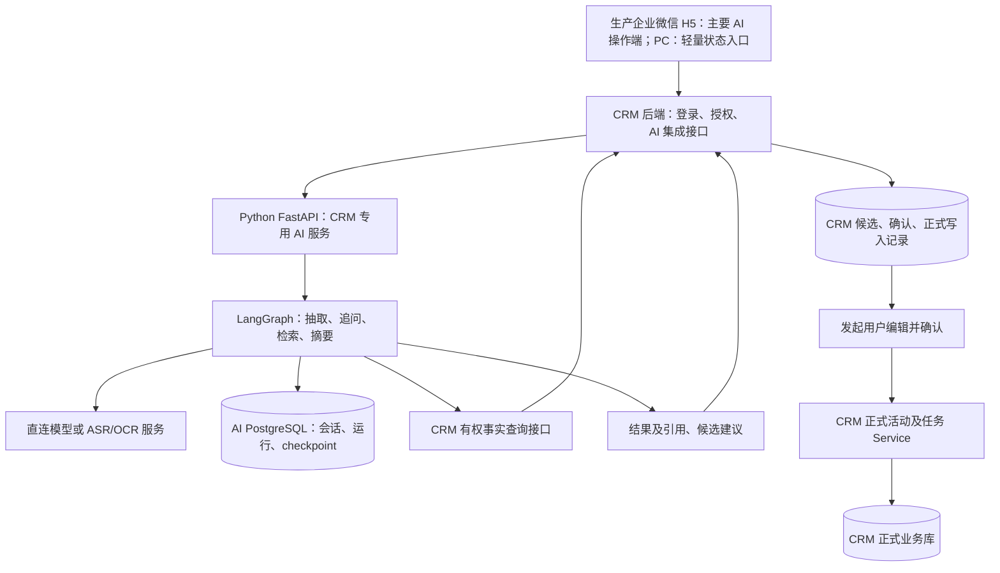
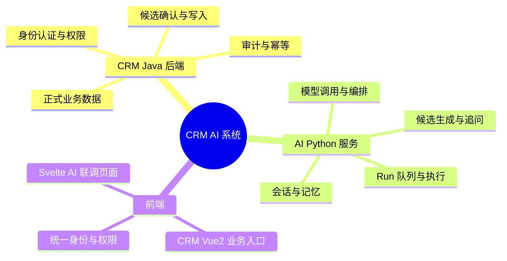
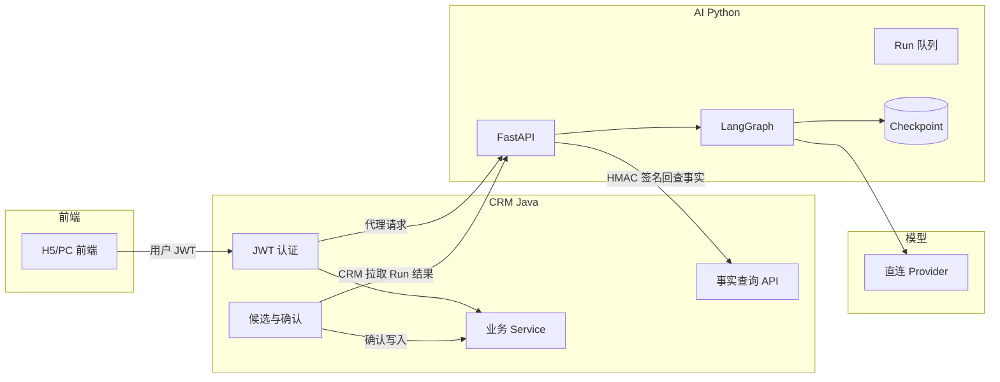
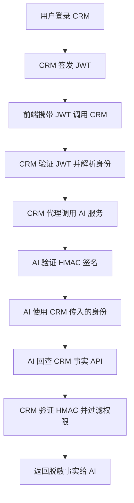
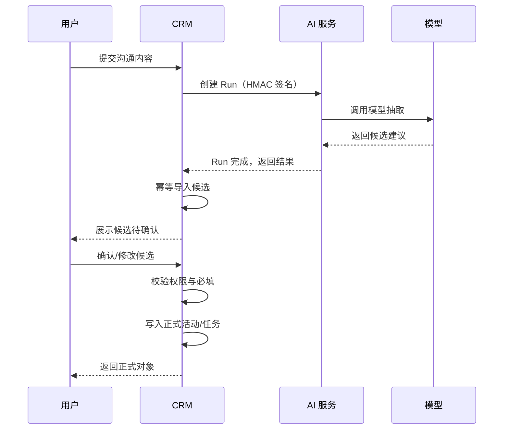
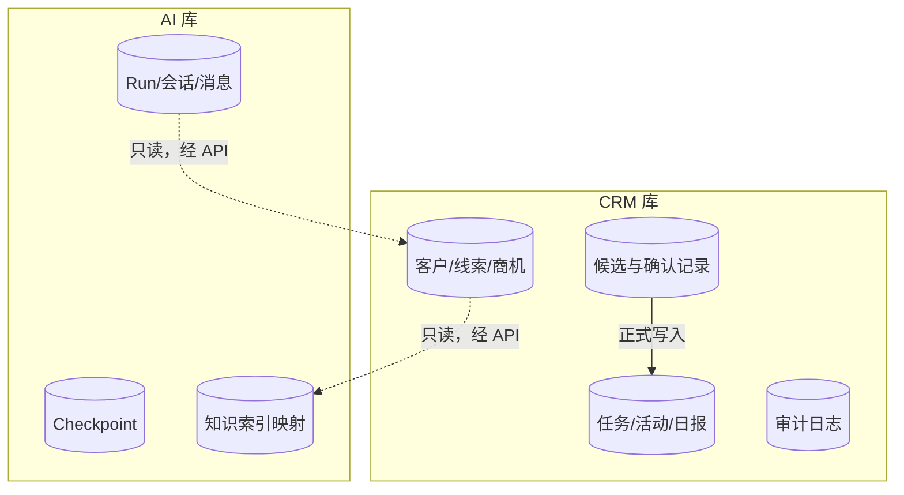
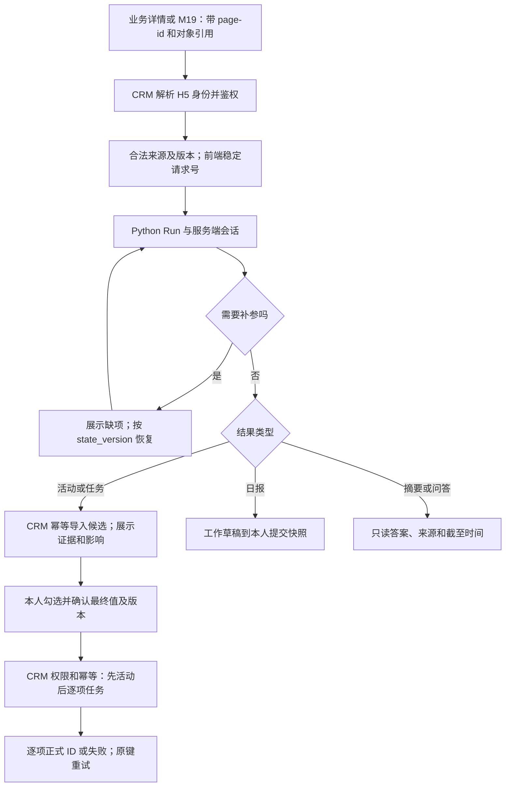

# CRM AI 接入需求文档（Python 重建版）

> V2.1｜2026-09-29｜Python 服务与联调端已具备部分实现，生产移动端及正式 CRM 闭环尚未验收。移动端草案对齐见第 11 节，代码证据见 [核验记录](代码进度核验-2026-09-29.md)。
> 本文替代旧 Java AI 方案；业务规则继承瑞赢首个销售闭环 PRD。配套：[实施计划](AI接入实施计划.md)。

## 1. 决策与仓库职责

新 AI 项目现为 `D:\github\CRM\sales-crm-ai`，模板现为 `D:\github\CRM\AgentZR`。采用 FastAPI、LangChain 模型适配、LangGraph 编排及 PostgreSQL 持久化 checkpoint；依赖以仓库锁文件和实测为准，不照搬模板宽泛版本范围。

CRM 后端 `D:\github\CRM\sales-crm-api-service` 保持现有 Java 业务系统，不改写为 Python；CRM PC 前端 `D:\github\CRM\sales-crm-admin-ui` 保持 Vue 2.7 + Vue CLI。当前 AI 开发联调使用本仓库 Svelte 前端，生产企业微信 H5 为主要 AI 操作端，H5 实际代码仓库和登录契约需在移动端工作包确认。用户的“不用 Java”指 AI 实现迁往 Python，不表示重写整个 CRM。

一期移除 smart-gateway、open-gateway、多通道机器人、平台 API Key 签发、Token 计量/费用/配额和平台门户。保留服务间认证、权限、基础并发限制、审计和错误处理，它们不是要删除的网关业务。Coze 等外部知识组件可选，不强制接入。

新项目管理所有新需求、计划、入口及联调脚本。模板仅作为来源，不修改 AgentZR；不复制其 .git、环境密钥、数据库数据、node_modules、虚拟环境或云发布配置。不继承其“模型必须经 Open Gateway”的规则，新模型调用直接从 Python Provider 出站。

## 2. 模板复用与去网关边界

已核验模板提交 `b14adec594a0c1f2b02f046ee028317501ccffc9`：存在 LangGraph StateGraph、`shared/persistence/checkpoints.py` 的 AsyncPostgresSaver、显式 checkpoint 初始化及连接生命周期管理。此为源码证据，不代表新项目已经验证这些能力。

- 选择性复用：`shared/agent_runtime`、`shared/agent_core`、持久化/checkpoint、合同类型、安全/日志、知识检索及对应测试中与 CRM 范围相关的部分。
- 适配后复用：problem_agent 图的节点组织方式，不照搬其业务流程；模型运行层拆出直连 Provider；技能执行只保留受限 CRM 查询及必要专项调用。
- 不迁入：两个 gateway 服务、shared/open_platform、平台计费及通道模型、平台租户/配额管理、无关政策/报表 Agent、独立审批平台和 AgentZR 管理前端。
- 模板 `shared/model_runtime/gateway.py` 引用 Open Gateway；`factory.py` 有 usage/cost 持久化。必须清理传递依赖、回调、数据库模型与环境变量，不是仅删部署服务。供应商响应中的 usage 不写日志、消息存储或 checkpoint。
- 模板 README 的部分记忆文档链接已不存在，以真实源码/测试为准。源码迁移需登记来源文件、提交、许可证与改造理由；模板未提交改动不默认纳入。

## 3. 总体交互与信任边界

“直接对接”是 CRM 与 Python 点对点，不经过 AgentZR 网关。浏览器默认通过 CRM 同源集成接口访问，不持模型密钥或长期服务凭据。该集成接口只处理本项目业务，不建设通用模型网关。

CRM 服务端鉴权后传操作者、受益人、对象范围、来源版本和关联请求号；使用限时签名/服务凭据保护服务间请求，Python 校验签名、audience、时效及重放。身份字段不能由浏览器任意指定。Python 回查 CRM 使用最小范围的用户授权上下文，CRM 每次重新鉴权，不允许 Python 直接查业务库或持全员权限。

AI 服务不可绕过本人确认写正式任务。首次集成采用 CRM 拉取 Run 结果并幂等导入候选；回调如后续启用需认证、重放保护、幂等及对账。不设计跨库事务，不以网络响应成功冒充正式写入成功。

## 4. 全量业务能力与调用方法

各能力共用创建 Run、查询结果、错误与取消契约，不按每个功能重建 Provider。

1. **沟通整理**：文字/粘贴/授权来源 → CRM 装配事实 → `communication.extract` → 活动及零到多任务建议 → CRM 候选 → 本人确认。对象精确匹配优先，歧义人工选，无匹配不自动建对象。
2. **会议批量任务**：同一会议批次复用抽取图；逐项补参/确认。先活动后任务，活动失败不写任务，部分任务失败不回滚成功项。
3. **对象匹配与相似任务**：CRM 有权集合及确定性检索为主，模型辅助名称/意图；相似仅提示，技术重复用幂等控制。
4. **日报**：`daily.draft` 读取当日正式事实，不取未确认候选；返回 CRM 日报底稿，保留工作草稿、首次底稿、提交快照，人工提交后冻结。
5. **客户/线索/商机摘要**：`object.summary` 返回只读状态、事实、缺失、建议及逐条引用，不覆盖正式字段。
6. **对象内追问**：`object.qa` 在对象绑定会话中使用有效历史与当前事实；每轮鉴权，事实/推断分开。
7. **轻量跨对象问答**：`business.qa` 仅调用白名单查询，限制条数/时间窗；不让模型生成任意 SQL，指标由 CRM 计算。
8. **知识问答**：`knowledge.qa` 检索已发布且有权版本，返回引用及版本；过滤发生在内容进入模型前，不允许先读无权全文再隐藏引用。
9. **会前准备**：`meeting.prepare` 主动触发，组合正式沟通/待办及有权知识；不自动建会议或对外发送。
10. **今日任务总结**：`today.summary` 归纳确定性底单，不创建任务或另造权威优先级。
11. **主管关注**：`manager.focus` 只读团队权限内底单，不评分、不作绩效结论、不自动派任务。
12. **录音**：ASR → 带时间锚点的校对文本 → 抽取；说话人不直接映射员工。
13. **图片**：OCR/经验证的多模态 → 原图锚点 → 抽取，关键数字日期需确认。
14. **文件**：普通文本解析优先，扫描页 OCR，保留页码/版本后复用抽取。
15. **大圆文档**：身份映射及授权读取 → 固定文本版本 → 抽取；来源撤权后不可继续使用。
16. **知识发布同步**：CRM 知识发布/停用 → 授权同步任务 → AI 索引映射，失败可重试；撤权先在可用集合中生效，不等待外部删除。

只有今日任务总结、主管关注、日报底稿允许按固定时间预生成，不主动推送。调度入口由 CRM 按受益人发起，Python 持久执行，不在两端重复调度同一业务任务。其他能力主动触发。30 秒内应有结果或明确处理中/失败状态，长任务离页可查询。

任务接收/验收、线索派领、商机规则、签到通知、权限审计和工商结构化查询仍归 CRM 确定性业务。增强输入逐项 POC 与启用验收，不能关闭后宣称全部完成。

## 5. 可靠执行与多轮：必做而非扩展项

### 5.1 可靠执行

LangGraph + PostgreSQL checkpoint 负责图状态保存和中断恢复，不自研图引擎。仍必须实现持久队列/扫描、认领租约与执行代次、重启恢复、重试耗尽及取消后的迟到隔离；checkpoint 不是任务调度器。

Run 与必要来源引用原子创建，幂等重复返回原 Run；节点保存已完成输出引用。外部调用不得占长数据库事务。模型返回后、结果持久化前崩溃可能导致重调，要明确处理及观测，不能宣称外部恰好一次。

CRM 导入结果使用稳定 `(ai_run_id, batch_id, item_id)` 唯一键及结果版本/hash；重放不覆盖人工修改。正式写入后返回丢失时按业务幂等键查询原结果。checkpoint 与 CRM 提交不是同一事务，不保存“已写入”虚假状态。

记录图版本、状态 Schema、模型/Prompt/配置版本、线程与执行代次。部署升级旧 checkpoint 须兼容或显式迁移/阻断；失败不降级无状态图。初始化/迁移显式执行，不在服务启动自动改库。

### 5.2 会话、短期记忆与补参

聊天历史、选入模型的窗口记忆、结构化流程状态分开。CRM 用户/对象绑定 conversationId，后端映射 LangGraph thread_id；每轮独立 requestId/runId，thread_id 不构成权限凭证。

保留有限完整轮次和必要摘要；字段值、缺项、等待问题、对象/来源/候选版本放结构化状态。补参 → 校验 → 展示最终候选 → 本人确认，不以聊天回答替代确认。

使用图 interrupt/resume 或等价原生机制实现 WAITING_INPUT/WAITING_CONFIRMATION，等待不占线程/租约。恢复前重新鉴权、校验状态版本；双标签页、重复消息和旧 resume 必须拒绝或返回原结果。

每轮重取当前有权事实；撤权历史/摘要/checkpoint 内容不可继续送模型，必要时终止旧会话另起线程。支持清空、结束、过期、切换对象和保留期清理；不做跨会话长期画像。

## 6. 数据库与页面归属

**独立 AI PostgreSQL 库**（拟名 sales_crm_ai）只存 AI 运行数据：模型/知识接入配置、能力绑定、conversation/message、Run/尝试、输入输出引用、图线程映射、框架 checkpoint、知识外部索引映射及脱敏操作审计。框架表由锁定版本的专用迁移管理，不手改其内部结构；Redis 可作缓存/唤醒，不作唯一事实源。不创建平台用量、计价和网关表。

**CRM 库**保留身份/权限、客户线索商机、知识主档及发布权限、活动任务、日报快照、候选/确认/正式写入幂等和审计。旧 Java 分支上的设计不等于主线已有表，P0 逐项核验。不得直接复制旧迁移编号到当前主线。

前台以 CRM 为唯一业务入口：新增 AI 接口联调页面；技术配置可在同入口受限页签维护模型、知识组件、能力绑定和健康状态；业务配置继续能力/来源/试点/预生成四页签。联调页面与销售页面分权，技术权限不等于全员正文可见权限。

## 7. CRM 集成对接方案

### 7.1 系统分工

| 组件 | 职责 | 禁止 |
|------|------|------|
| **CRM Java** | 身份认证、权限过滤、正式业务写入、候选确认、审计 | 直连模型供应商、持有模型 Key |
| **AI Python** | 模型调用、Prompt 编排、会话管理、候选生成、Run 队列 | 直写 CRM 正式表、绕过权限 |
| **前端** | 用户交互、候选展示与确认、Run 状态展示 | 持有服务密钥、直接调用 AI |

### 7.2 集成架构

### 7.3 鉴权机制

**鉴权层次：**

| 层次 | 机制 | 说明 |
|------|------|------|
| 用户 → CRM | JWT Bearer | CRM 签发，含用户身份与权限 |
| CRM → AI | HMAC-SHA256 签名 | 含 key_id、timestamp、nonce、user_id |
| AI → CRM | HMAC-SHA256 签名 | 回查事实 API，最小权限 |
| 防重放 | nonce + 有效时间窗 | AI 侧已使用数据库 nonce；Java 当前为实例内 nonce，集群一致性待 P4 验证。时窗以冻结配置为准，不以本表替代真实契约 |

### 7.4 核心流程

### 7.5 数据边界

**核心原则：**
- AI 库不存正式业务事实，只存运行数据与授权索引
- CRM 库是正式事实唯一来源
- 跨库只通过 API，不直连数据库
- 候选 ≠ 事实，必须人工确认

## 8. AI 专用接口联调页面

当前实现为本仓库 `frontend/` 独立 Svelte 联调应用，服务端 `/playground/api` 注入测试身份，仅 dev/test 且显式配置启用，不是正式 CRM 用户授权。生产 H5/PC 使用 CRM 登录与业务权限；不得把联调代理或测试身份搬到移动端。开发联调页面不能作为 PC 完整 AI 操作端交付，不迁入 AgentZR Vue3 页面。

提供文本抽取、会议补参、连续问答、知识引用、摘要/日报、ASR/OCR/文件/大圆测试入口；按能力分组，未实现项标记未实现，不伪造成功。展示 Run/会话/步骤状态、请求耗时、缺参/引用、脱敏请求响应、失败重试与恢复；不展示 Key、完整内部堆栈、Token 或费用。

明确区分 Stub、真实 Provider、真实 CRM 三种模式。Stub 不写正式业务；真实写入仅限明确测试环境、测试对象及用户逐项确认。测试页不得绕过业务鉴权、确认和幂等。对比不同 profile 仅给技术角色，普通销售不选模型。

## 9. 一键启动脚本要求

脚本放新项目 `scripts/dev.ps1`，支持 start/status/stop、可配置 Python/前端/CRM 路径和端口；当前默认 AI API/worker 与本仓库 Svelte 联调端，生产 H5/CRM PC 的启动及接入另按其工程约定。CRM 后端默认连接指定开发环境，可选显式参数启动本地 Java CRM。所谓“启动前后端”不意味着把 CRM 后端一起改成 Python。

启动前检查 Python 虚拟环境、锁定依赖、Node/包管理器、端口、环境配置、PostgreSQL 迁移和 CRM 健康；不自动安装/升级全局工具、不建真实库或静默执行迁移。缺依赖输出操作提示，失败清理本次启动进程。

进程后台隐藏窗口运行，日志脱敏落本地忽略目录，记录 PID/启动时间/命令归属；stop 仅终止本脚本启动且验证身份的进程，不能按端口杀其他服务。端口冲突清晰失败；重复 start 幂等，status 区分已运行和不健康。Node 版本以 Vue2 工程实测确定，不盲目用 package engines 的过宽范围。

## 10. 验收与排除范围

必须通过真实 PostgreSQL 重启恢复、旧执行者迟到、重复 resume、跨用户会话、历史撤权、CRM 超时重放、部分任务成功、知识生成前过滤和手工降级测试；分别记录框架测试、Stub、真实模型、真实 CRM 闭环证据。

不做：Java AI SDK/公共 JAR、两个网关、平台计费配额、多通道机器人、任意 SQL、自主正式写入、公司级模型运营平台。模板“已经完成”的描述不可当本项目验收。本文定义目标，实际完成度以实施计划和可复核测试记录为准。

## 11. 移动端 AI 入口与 PRD 对齐（2026-09-29 增补）

### 11.1 需求基线与评价

移动端草案位于 [瑞赢1.0-移动端原型](../../sales-crm-api-service/docs/瑞赢1.0-移动端原型/README.md)，包内自述 V2.1/2026-09-16，当前仍在编辑；以 `assets/dev-spec.js` 为页面研发描述主源，pages 为按钮/文案佐证，notes 不能代替缺失的 note 原文。后端 [05 AI](../../sales-crm-api-service/docs/V0.1.0/瑞赢首个销售闭环/prd/05-Agent候选与人工确认.md) 与 04/07/08 继续约束业务权限、状态和正式写入；Coze 必选技术条款按本项目 Python 决策替代。

评价：移动端稳定 page-id、就近业务入口、上传归属和纪要/任务分离值得保留；但草稿过期、追踪任务、自动录音、对话建档和消息设置仍包含与后端冲突的旧规则，不能直接据此冻结接口。详见 [移动端差异建议](移动端PRD对齐建议-2026-09-29.md)，其中 M-01～M-12 未决项保持待确认，不自动扩入一期。

### 11.2 页面到能力和数据流的映射

- **M01 工作台、M09 团队**：分别展示 `today.summary`、`manager.focus` 的规则底单归纳、截至时间及有权源对象；不创造优先级/绩效评分或自动派任务，前端只读。
- **M19 浮动助手**：统一已批准能力入口，带当前对象上下文，支持 `object.summary`、`object.qa`、`business.qa`、`knowledge.qa`、`meeting.prepare`；主动切换对象须确认新上下文并使旧候选失效，不能串用原会话材料。
- **M20 快捷创建**：一期只进入沟通整理/任务候选或对应手工业务表单；其客户/联系人/线索/商机/拜访对话建档属于待确认扩范围，不注册为 AI 自动写入工具。
- **M10/M11 沟通与上传**：文字/有权原件 → 来源 ID/版本 → 格式校验及 ASR/OCR/文件解析 → 授权对象匹配 → `communication.extract`。Top3 可为推荐展示，不是固定正确率保证；不显示复杂置信度，不强绑无匹配对象。
- **M03 AI 待确认**：CRM 候选列表/详情/编辑/忽略/确认，展示活动和任务、证据/缺参/人工值；确认后的正式对象与失败回执来自 CRM，不从 AI Run succeeded 推断已写入。
- **M12～M15 拜访**：签到/签退是 CRM 事实；用户主动提供授权录音/速记后生成纪要建议。正式拜访总结保存与派生销售活动/任务的目标映射由 P4 冻结，不把活动候选直接当拜访完成，不重复生成正式事实。
- **M23～M25 会议**：会议信息由 CRM 创建；用户主动上传/输入并发起整理 → 同来源批次候选 → 补参 → 勾选确认 → 活动先写、任务逐项写。取消自动追踪任务规则；会议录音 SDK/实时转写待独立范围确认。
- **M16 日报**：`daily.draft` 使用正式事实，首次 AI 底稿/工作草稿/提交快照分别保存；刷新保护人工编辑，提交后冻结。AI 预生成不推送，日报未提交业务提醒按白名单处理。
- **M17/M18 知识**：CRM 负责列表/正文/发布权限，`knowledge.qa` 生成前过滤；引用包含文档 ID/版本/定位，打开/下载重新鉴权。复制受控链接，不默认开放外部转发。
- **M02/M27 消息、M04～M08/M21/M22 正式任务/日程**：走确定性 CRM Service，不新增模型调用来改变接收/验收/日程状态。深链可携带业务定位，但不能携带可冒用服务身份。

### 11.3 移动端统一交互契约（目标，待 P4 冻结）

页面最少携带/保存：page-id、业务 capability、对象/来源引用、客户端请求号、服务端 Run/会话/候选 ID、当前状态版本及返回路径；员工身份和授权范围由 CRM 解析。现有 `/mobile/*`、`/assistant/*` 为草案接口，不等于现有 Python/Java API，需维护映射后联调。

离页/收起不自动取消任务，刷新按已保存 ID 查询恢复，不重新 POST 创建；只有新的主动生成产生新请求号。重复点击/弱网重投复用原键。30 秒内有明确状态，上传/转写长任务可继续查询；分开未生成/处理中/待补参/待确认/部分写入失败/只读完成/无证据/失效/不可用。

确认时提交明确选中项、候选/来源版本及最终值；同一会议批次才可批量，不把 override 列表当作勾选范围。本人补参不等于确认，责任人与截止时间缺失需显式补齐。技术错误重试与重新生成分开，业务冲突提示重新核对，不重放旧操作。

### 11.4 权限、生命周期与移动端验收

会话在服务端持久化，前端缓存只是恢复定位；会话关闭/过期不自动使业务候选过期，候选超过历史阈值仍可在有权条件下处理。来源更新/对象切换/撤权才触发对应候选失效。历史正文、摘要、checkpoint 和文件 URL 都在再次展示/使用前校验权限；知识新检索过滤不能代替历史撤权。

验收新增：真实 H5 登录而非 playground 身份、刷新/离页/弱网重投、跨用户深链、同名有权对象选择、对象切换、待补参恢复版本冲突、活动失败及任务部分成功、写入超时原键重试、日报编辑后刷新、文档停用/撤权后历史查看及再次追问。

不因 Svelte 联调功能完成而标记移动端完成。移动端草案更新后，以 M 编号记录决策、修改版本与回归用例；未决扩范围入口默认不启用。本轮不修改移动端源 PRD，也不批准自动录音、对话建档或外部分享上线。
