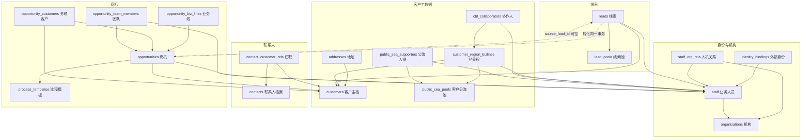

# PostgreSQL 数据库规范（CRM 主库约定）

> 本文从 `sales-crm-api-service`（CRM Java 后端仓）`docs/研发补充/数据库说明.md` 同步而来，作为本仓库
> 涉及 CRM PostgreSQL 库（`zrcrm`）时的**只读约束依据**。2026-10-02 同步。
>
> **边界**：本文描述的是 CRM 主库，AI 服务**不得直连该库**，只通过 CRM 授权接口访问；
> AI 自有库（`zrcrm_ai`，checkpoint/会话/运行记录）的表结构另见 `app/persistence/migrations/`，不受本文约束。
> 原文中的相对链接已改写为 CRM 仓绝对路径，避免跨仓失效。

> 范围：身份映射 + 客户主数据 + 联系人/地址 + 公海经营权 + 线索 + 商机。  
> DDL 事实源：`D:/github/CRM/sales-crm-api-service/db/migrations/V001__identity_master_data.sql`（每列有 `COMMENT`）。  
> 字段级清单：`D:/github/CRM/sales-crm-api-service/specs/001-identity-master-data/data-model.md`。  
> 产品口径：`D:/github/CRM/sales-crm-api-service/docs/产品新版原型/prd.md` V0.14.0 §3–§4。

本文只讲**每张表干什么、和谁有关**。确认完这一层，再进入身份映射的接口实现。

---

## 1. 读表前先记住的约定

| 约定 | 含义 |
| --- | --- |
| 技术主键 `CHAR(12)` | 两位大写前缀 + 10 位序列，如 `ST0000000001`。业务表互相引用时只存这个 id。 |
| 展示号 ≠ 主键 | `CUS-YYYYMM-NNNN`、`LED-…`、`OPP-…` 给人看，创建后不可变，**不能**当关联键。 |
| 无物理外键 | 库里不建 `FOREIGN KEY`。完整性由应用维护；下表「逻辑指向」都是约定，不是数据库约束。 |
| 软删 | 业务表都有 `deleted BOOLEAN`。有效行一律 `deleted IS FALSE`。合并客户也是软删，禁止物理删。 |
| 时间 | `TIMESTAMPTZ`。`updated_at` 只由触发器 `set_last_update()` 写，应用不要手改。 |
| 人员与机构 | 业务表只引用 `staff.id`。ZR 工号同步自 UCS `login_name`；UCS 用户 id 只在 `identity_bindings`。机构树在本地 `organizations`，人机多对多在 `staff_org_rels`。 |
| 主档 vs 经营权 | 客户主档一份；公海只流转「客户 × 区域 × 业务线」经营权，**主档不入池、不复制**。 |
| 线索池 ≠ 客户公海 | `lead_pools` 与 `public_sea_pools` 两套配置，不得混用。 |
| 表名 | 复数 `snake_case`，不加 `sys_` / `basic_` / `biz_` 前缀。 |

本切片**未建**的表（后续阶段）：任务、销售活动、日程、日报、门店/资方、会议、消息、知识文档、审计日志表（明文查看可先走应用日志）。客户组关系表不在本批（客户主表不加 `parent_id`）。

---

## 2. 对象关系总图

箭头是逻辑引用（应用层），不是数据库外键。`staff` 作为负责人/协作人被多表引用，图中只画业务主路径，审计列 `created_by_id` 等一律省略。



`biz_code_counters` 不进入业务图：只给展示号按「前缀 + 年月」发号。

---

## 3. 按域说明

### 3.1 身份与发号

#### `biz_code_counters` — 展示号月序

- **作用**：按前缀（CUS / LED / OPP / CNT / ADR）和年月 `YYYYMM` 原子递增序号，拼出 `XXXX-YYYYMM-NNNN`。
- **关系**：独立表，复合主键 `(prefix, yyyymm)`，不是 CHAR(12) 业务实体。
- **要点**：占位客户用 `CUS-000000-0000`，年月可走 `000000`。主键 id 另由各表序列生成，与此无关。

#### `organizations`（前缀 OG）— 本地机构树

- **作用**：公司内部机构底座，同步自用户中心 `basic_organizationinfo`。供以后算团队/组织数据范围，也可在断开 UCS 后仍保留机构。
- **关系**：自关联 `parent_id`；被 `staff.org_id`（主部门冗余）和 `staff_org_rels` 引用。
- **要点**：
  - UCS 机构 id 存在 `ucs_org_id`，有效行唯一；业务表不散落 36 位 UCS id。
  - `org_category`：0 部门 / 1 渠道商或经销商；`is_external` 是否外部。先全量同步，**默认不参与团队/组织权限展开**。
  - 不等于客户集团，也不等于门店。
  - 连着 UCS 时本地不改名称、树、启停。

#### `staff`（前缀 ST）— 本系统业务人员

- **作用**：瑞赢自己的人员主档。后续所有「负责人 / 协作人 / 创建人」都指向这里。
- **关系**：被几乎所有业务表逻辑引用；一对多挂 `identity_bindings`、`staff_org_rels`。
- **要点**：
  - `zr_employee_no` 同步自 UCS `login_name`，格式 `^ZR[0-9]{8}$`，有效行唯一。**不是**技术主键。不符则进异常队列，不建 staff。
  - `org_id` 指向本地 **主部门** `organizations.id`，以关系表 `is_main` 为准；**不是**多租户字段。
  - `role_codes` 是职责方向 R1–R5，可多值；**不是** UCS `basic_roleinfo` 应用角色。
  - 停用用 `DISABLED`，不删历史责任记录。姓名/工号/组织/启停连着 UCS 时只读同步。不同步密码和身份证。

#### `identity_bindings`（XB）— 外部身份映射

- **作用**：把 UCS（本期）/ 企微（预留）用户 id 绑到 `staff.id`。登录时用外部 id 解析出 `staff.id`，业务上下文只认 staff。
- **关系**：多对一 `staff`。同一 `(provider, external_id)` 有效行唯一。
- **要点**：UCS `basic_userinfo.id`、企微 userid **不得**出现在客户/线索/商机表上。

#### `staff_org_rels`（SO）— 人员与机构

- **作用**：人机多对多，同步自 UCS `mapping_usercomposition`。团队/组织范围展开以本表为准。
- **关系**：`staff_id` → 人员；`organization_id` → 本地机构。`(staff_id, organization_id)` 有效行唯一。
- **要点**：`is_main` 主部门，每人有效行至多一条；UCS 出现两个主部门则进异常队列。`ucs_mapping_id` 仅对账。

---

### 3.2 客户主档、经营权、公海

核心拆分：**一份客户主档** vs **多条经营权**。

```
customers 1 ──* customer_region_bizlines  *──1 public_sea_pools（入池时）
                      │
                      └──* cbl_collaborators
```

#### `customers`（CU）— 客户主档

- **作用**：全公司唯一客户对象。名称、类型、信用代码、治理状态、价值分级都在这里。
- **关系**：
  - 可选 `archive_owner_id` → `staff`（主档维护人，**可空**，不表示某条业务线的经营权）。
  - 可选 `merged_into_id` → 另一条 `customers`（合并目标）。
  - 被地址、经营权、联系人任职、线索、商机主客户/关联客户引用。
- **要点**：
  - 展示号 `customer_code` 创建后不可变。
  - `master_status`：待治理 / 正常 / 已合并。合并后软删，禁止物理删。
  - 主档**不入公海**。入池的是经营权行，不是客户行。
  - `is_placeholder=TRUE` 的有效行全库至多一条（种子 `CUS-000000-0000`），只给「未知主体」商机临时挂靠，不能当真实客户经营。
  - 名称查重走 `pg_trgm`；信用代码有效行唯一。

#### `customer_region_bizlines`（CB）— 客户 × 区域 × 业务线经营权

- **作用**：真正被认领、释放、进公海的对象。同一客户可在不同区域、不同业务线有多条经营权。
- **关系**：
  - `customer_id` → `customers`
  - `owner_id` → `staff`（有主时必填，入池清空）
  - `pool_id` → `public_sea_pools`（入池必填，有主清空）
  - 一对多 `cbl_collaborators`
- **要点**：
  - 自然键 `(customer_id, region_code, biz_line_id)` 有效行唯一。
  - `ownership_status`：`OWNED` 有主 / `REGIONAL_SEA` 区域公海 / `NATIONAL_SEA` 全国公海。
  - 认领/分派用 `version` 乐观锁 + 条件更新（只允许从公海状态抢到有主），防止双主。
  - `protection_until` 保护期；到期未跟进可回收。

#### `cbl_collaborators`（BC）— 经营权协作人

- **作用**：某条经营权上的协作销售。不替代 `owner_id` 主负责人。
- **关系**：`cbl_id` → 经营权；`staff_id` → 人员。`(cbl_id, staff_id)` 有效行唯一。

#### `public_sea_pools`（PH）— 客户公海池（配置）

- **作用**：定义区域公海 / 全国公海的范围、持有上限、保护天数。池里没有客户主档副本。
- **关系**：被经营权 `pool_id` 引用；一对多 `public_sea_supporters`。
- **要点**：
  - `layer`：`REGIONAL` / `NATIONAL`。区域池必须绑 `bound_region_code`。
  - `scope_json` 描述适用范围。发布时两条已生效池不得同时命中同一「客户+区域+业务线」。
  - `DRAFT → ACTIVE → DISABLED`。已发布用 `version` 递增，不原地改历史口径。

#### `public_sea_supporters`（PS）— 公海支持/管理人员

- **作用**：谁能看脱敏摘要并认领（`SUPPORT`），谁能分派/回收/转池（`MANAGER`）。
- **关系**：`pool_id` → 公海池；`staff_id` → 人员。
- **要点**：人员变更属高影响动作，须授权留痕（审计表本切片可后补）。

---

### 3.3 联系人与地址

联系人是**独立档案**，不是客户的子表字段。一人可任职多家客户。

#### `contacts`（CN）— 联系人档案

- **作用**：人的主档（姓名、手机、微信、邮箱、档案级职务/单位文本）。
- **关系**：通过 `contact_customer_rels` 多对多关联客户。
- **要点**：不采集身份证号。手机为敏感字段，接口默认脱敏，明文查看须单独授权并留痕。`org_name` 是自由文本，**不等于**客户主档。

#### `contact_customer_rels`（CR）— 任职关系

- **作用**：某人在某客户下的角色、是否主要联系人、部门、该客户下职务、在职/已离职。
- **关系**：`contact_id` → 联系人；`customer_id` → 客户。同一对有效行唯一。
- **角色枚举**：决策 / 影响 / 使用 / 采购 / 技术 / 财务 / 其他。

#### `addresses`（AD）— 客户地址

- **作用**：客户的结构化地址，按类型区分注册地、办公地、经营地、项目地。
- **关系**：多对一 `customers`。
- **要点**：失效改 `status=INACTIVE`，不物理删除。同一客户同一类型，有效默认地址至多一条。

---

### 3.4 线索与线索池

线索是独立对象，**可以没有客户**。补客户 ≠ 已转化。

#### `lead_pools`（LP）— 线索池（配置）

- **作用**：线索入池、认领、保护天数的配置。
- **关系**：被 `leads.pool_id` 引用。
- **要点**：不得与 `public_sea_pools` 共用。默认保护 7 天。

#### `leads`（LD）— 线索

- **作用**：一条原始销售意向。`raw_content` 必填且不可被清洗/抽取结果覆盖。
- **关系**：
  - 可选 `customer_id` → 客户（不得为填关联而自动造模糊客户）
  - 可选 `pool_id` → 线索池
  - 可选 `owner_id` → 人员
  - 转化后 `converted_opp_id` → 商机（与商机 `source_lead_id` 互指，同一事务写入）
- **要点**：
  - 业务状态 `biz_status` 与入池状态 `pool_state` **分开**：前者是跟进进度，后者是在不在池里。
  - `biz_status`：待处理 / 跟进中 / 待培育 / 已转化 / 无效。跟进中必须有下一步动作和下次跟进时间。
  - `pool_state`：未入池 / 在池 / 已领 / 已出池。
  - **转化后这一行仍是线索**，类型不变，只改状态并挂商机 id。

---

### 3.5 商机与流程模板

商机必须有**主客户**和**主业务线**。阶段只存在商机主档，协同业务线不拆阶段。

#### `process_templates`（TP）— 商机流程模板

- **作用**：按业务线 + 销售场景定义统一管理阶段。种子默认：`LEAD / QUALIFY / PROPOSE / NEGOTIATE / WIN`。
- **关系**：创建商机时把 `id` 和 `version` **冻结**到商机上；之后改模板不影响在途单。
- **要点**：`(biz_line_id, sales_scene, version)` 有效行唯一。`biz_line_id='*'`、`sales_scene='DEFAULT'` 为通用默认。

#### `opportunities`（OP）— 商机主档

- **作用**：一笔在谈生意：名称、主客户、当前阶段、过程状态、负责人、金额、预计成交日。
- **关系**：
  - `primary_customer_id` → 客户（必填；未知主体才允许占位客户）
  - `owner_id` → 人员（必填）
  - `template_id` + `template_version` → 模板冻结
  - 可选 `source_lead_id` → 线索
  - 一对多：业务线明细、关联客户、团队成员
- **要点**：`process_status` 进行中 / 休眠 / 已关闭。金额属敏感字段。

#### `opportunity_biz_lines`（OB）— 商机业务线

- **作用**：一条主业务线（决定用哪套模板）+ 可选协同业务线。
- **关系**：多对一商机。每商机恰好一条 `line_role=PRIMARY`。
- **要点**：协同行（`COLLAB`）**不得**再存独立阶段、负责人、关闭结果。

#### `opportunity_customers`（OC）— 商机关联客户

- **作用**：主客户之外还可以挂关联方（集团、渠道等）。
- **关系**：商机 ↔ 客户。每商机恰好一条 `is_primary=TRUE`，且必须与主档 `primary_customer_id` 一致。

#### `opportunity_team_members`（TM）— 商机团队

- **作用**：负责人以外的成员。负责人在 `opportunities.owner_id`，不重复写入本表（实现时可二选一，DDL 注释按「其余成员」）。
- **关系**：`(opportunity_id, staff_id)` 有效行唯一。

#### 线索 → 商机

同一事务：新建商机（含主客户、主业务线、冻结模板）+ 更新线索 `biz_status=CONVERTED` 且写入 `converted_opp_id`。线索行还在，展示号仍是 `LED-`。

---

## 4. 表清单（21 张）

| 表 | 前缀 | 域 | 一句话 |
| --- | --- | --- | --- |
| `biz_code_counters` | — | 发号 | 展示号按月计数 |
| `organizations` | OG | 身份 | 本地机构树，同步自 UCS |
| `staff` | ST | 身份 | 本系统人员，业务表只引用其 id |
| `identity_bindings` | XB | 身份 | UCS/企微 id ↔ staff |
| `staff_org_rels` | SO | 身份 | 人员与机构多对多 |
| `customers` | CU | 客户 | 唯一客户主档，不入公海 |
| `customer_region_bizlines` | CB | 客户 | 区域业务线经营权，公海流转对象 |
| `cbl_collaborators` | BC | 客户 | 经营权协作人 |
| `public_sea_pools` | PH | 客户 | 客户公海池配置 |
| `public_sea_supporters` | PS | 客户 | 公海支持/管理员 |
| `contacts` | CN | 联系人 | 联系人档案，不含身份证 |
| `contact_customer_rels` | CR | 联系人 | 人在客户下的任职 |
| `addresses` | AD | 客户 | 客户地址，失效不物理删 |
| `lead_pools` | LP | 线索 | 线索池配置 |
| `leads` | LD | 线索 | 线索；转化后类型不变 |
| `process_templates` | TP | 商机 | 流程模板，创建时冻结 |
| `opportunities` | OP | 商机 | 商机主档，必须有主客户 |
| `opportunity_biz_lines` | OB | 商机 | 主/协同业务线 |
| `opportunity_customers` | OC | 商机 | 主客户 + 关联方 |
| `opportunity_team_members` | TM | 商机 | 团队成员（非负责人） |

---

## 5. 逻辑关系清单

| 从表.列 | 指向 | 基数 | 说明 |
| --- | --- | --- | --- |
| `organizations.parent_id` | `organizations.id` | * : 0..1 | 机构树，根为空 |
| `staff.org_id` | `organizations.id` | * : 0..1 | 主部门冗余 |
| `identity_bindings.staff_id` | `staff.id` | * : 1 | 外部身份必须落到业务人员 |
| `staff_org_rels.staff_id` | `staff.id` | * : 1 | |
| `staff_org_rels.organization_id` | `organizations.id` | * : 1 | 一人可多部门 |
| `customers.archive_owner_id` | `staff.id` | * : 0..1 | 主档维护人，可空 |
| `customers.merged_into_id` | `customers.id` | * : 0..1 | 合并目标 |
| `customer_region_bizlines.customer_id` | `customers.id` | * : 1 | 经营权从属于主档 |
| `customer_region_bizlines.owner_id` | `staff.id` | * : 0..1 | 有主必填，入池空 |
| `customer_region_bizlines.pool_id` | `public_sea_pools.id` | * : 0..1 | 入池必填，有主空 |
| `cbl_collaborators.cbl_id` | `customer_region_bizlines.id` | * : 1 | |
| `cbl_collaborators.staff_id` | `staff.id` | * : 1 | 不替代主负责人 |
| `public_sea_supporters.pool_id` | `public_sea_pools.id` | * : 1 | |
| `public_sea_supporters.staff_id` | `staff.id` | * : 1 | |
| `addresses.customer_id` | `customers.id` | * : 1 | |
| `contact_customer_rels.contact_id` | `contacts.id` | * : 1 | |
| `contact_customer_rels.customer_id` | `customers.id` | * : 1 | 一人多家客户 |
| `leads.customer_id` | `customers.id` | * : 0..1 | 可无客户 |
| `leads.pool_id` | `lead_pools.id` | * : 0..1 | |
| `leads.owner_id` | `staff.id` | * : 0..1 | |
| `leads.converted_opp_id` | `opportunities.id` | * : 0..1 | 转化后填写 |
| `opportunities.primary_customer_id` | `customers.id` | * : 1 | 不可空 |
| `opportunities.owner_id` | `staff.id` | * : 1 | |
| `opportunities.template_id` | `process_templates.id` | * : 1 | 冻结模板 |
| `opportunities.source_lead_id` | `leads.id` | * : 0..1 | 手工建商机可空 |
| `opportunity_biz_lines.opportunity_id` | `opportunities.id` | * : 1 | 恰好一条 PRIMARY |
| `opportunity_customers.opportunity_id` | `opportunities.id` | * : 1 | 恰好一条主客户 |
| `opportunity_customers.customer_id` | `customers.id` | * : 1 | |
| `opportunity_team_members.opportunity_id` | `opportunities.id` | * : 1 | |
| `opportunity_team_members.staff_id` | `staff.id` | * : 1 | |

审计列 `created_by_id` / `updated_by_id` / `deleted_by_id` 均逻辑指向 `staff.id`，上表不重复列出。

---

## 6. 种子数据

| 对象 | 内容 | 用途 |
| --- | --- | --- |
| 占位客户 | `CUS-000000-0000` / 名称「公共占位客户」 / `is_placeholder=TRUE` | 未知主体商机临时关联 |
| 默认流程模板 | 业务线 `*`、场景 `DEFAULT`、阶段五段 | 无专用模板时创建商机 |

---

## 7. 请确认的点

请先确认下面这些拆分是否符合产品预期，再进入下一阶段（身份映射接口）：

1. 人员：业务表只存 `staff.id`；ZR 工号同步自 UCS `login_name`；UCS/企微 id 只进绑定表。本地有机构树和人机关系；连着 UCS 时人员/机构主数据只读。
2. 客户主档与经营权分离；公海只流转经营权，主档始终一份。
3. 联系人独立建档，任职关系另表；不采集身份证。
4. 线索允许无客户；转化后线索行保留。
5. 商机必须有主客户 + 主业务线；模板创建时冻结。
6. 本批不建任务/日程/日报/门店/活动等表。
7. 库内不建物理外键。

有异议直接改这一份说明和 `V001`，不要先写业务代码。

---

## 8. 已确认：客户组织与门店（2026-09-18）

讨论结论如下。**不改当前 `customers` 表结构。**

| # | 结论 | 说明 |
| --- | --- | --- |
| 1 | **客户主表不加 `parent_id`** | 不做「预留上级客户」。PRD（`CUST-04`）规定组织用客户组关系：多级、可多父、无环，**不在客户主表存单一父级**。现在加空列等于锁定单父树，和后续客户组打架，也和 `merged_into_id` 语义重叠。真要最简单的上级客户，放到客户组切片再评估，而不是改 V001。 |
| 2 | **客户表其余字段保持现状** | `customer_type` 已有 `GROUP / ORG / SOLE / PERSON`，本批只允许建集团客户档，不实现组成员维护。 |
| 3 | **本批不做门店** | 门店、门店业务线、门店资方、门店级责任覆盖全部后置。需求确认后再开切片。 |
| 4 | **门店永不并入客户表** | 无独立工商身份的经营点用门店对象（客户 1:N 所属）；有信用代码的先建独立客户。联系地走 `addresses`。不把办事处/门店/联系地做成客户父子或客户类型。 |

销售责任仍在经营权（客户 × 区域 × 业务线）；门店若后续落地，默认继承经营权，需要时再做门店级覆盖，不在客户主档或 `parent_id` 上表达谁负责哪个点。

---

## 9. 已确认：UCS 同步与本地机构（2026-09-18）

| # | 结论 |
| --- | --- |
| 1 | ZR 工号 = UCS `login_name`，写入 `staff.zr_employee_no`；UCS 用户主键写入 `identity_bindings`。 |
| 2 | 人与机构多对多，本地 `staff_org_rels` 对应 `mapping_usercomposition`（含主部门 `is_main`）。 |
| 3 | 渠道商/外部机构先全量同步，记下 `org_category`、`is_external`；默认不进入团队/组织数据范围。 |
| 4 | 连着 UCS 时本地不允许改姓名、工号、组织关系、启停。不同步密码、身份证。 |
| 5 | 表名不加 `sys_` / `basic_` / `biz_` 前缀。UCS 应用角色不替代 CRM 数据权限。 |
| 6 | 独立登录是后话；现在只保留映射，不做本地账密。 |

同步任务的全量/增量策略实现阶段再定。客户表、经营权、线索、商机结构不因此改动。
