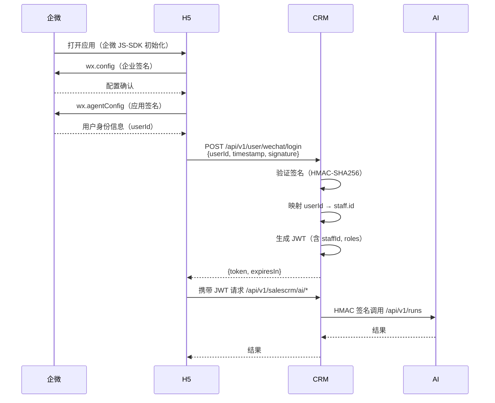
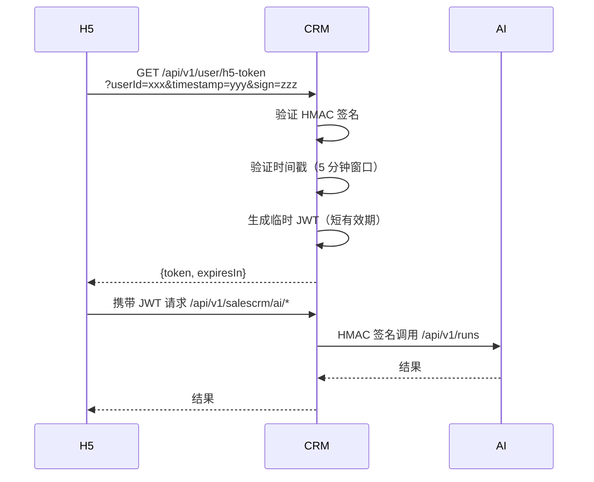

# 移动端 H5 与企微认证方案

> V1.0｜2026-09-29｜基于现有 CRM 架构的移动端认证方案设计。
> 配套文档：[AI接入需求文档](AI接入需求文档.md)、[CRM集成盘点](CRM集成盘点.md)

## 1. 方案选择

### 1.1 推荐方案

| 环境 | 方案 | 理由 |
|------|------|------|
| **企微应用内** | 企微 JS-SDK + 后端签名验证 | 企微环境已有用户身份，无需额外登录；安全性高；用户体验好 |
| **移动端 H5（非企微）** | HMAC 签名临时令牌 | 无需跳转登录页；可控制有效期；实现简单 |

### 1.2 不推荐方案

| 方案 | 不推荐理由 |
|------|------------|
| 移动端内置 HMAC 密钥 | 密钥泄露风险高，无法安全存储 |
| 企微 OAuth 跳转 | 企微环境内跳转体验差，且需要额外配置 |
| 长期 Token | 泄露后风险窗口大，不符合最小权限原则 |

---

## 2. 企微应用内免登方案

### 2.1 交互流程



### 2.2 认证机制

#### 2.2.1 企微签名验证

**签名算法**：HMAC-SHA256

**签名串**（企微标准）：
```
jsapi_ticket
noncestr
timestamp
url
```

**验证流程**：
1. H5 调用企微 JS-SDK 获取 `jsapi_ticket`
2. H5 生成 `noncestr`（随机字符串）和 `timestamp`（时间戳）
3. H5 计算签名：`sha1(jsapi_ticket + noncestr + timestamp + url)`
4. H5 将 `userId`、`timestamp`、`signature` 发送到 CRM 后端
5. CRM 后端使用相同算法验证签名

#### 2.2.2 JWT 生成

**JWT Claims**：
```json
{
  "sub": "staff.id",
  "name": "staff.displayName",
  "roles": ["R1", "R2"],
  "iss": "https://identity-fat.lunz.cn",
  "exp": 1696000000,
  "iat": 1695996400
}
```

**有效期**：
- 默认 2 小时（可配置）
- 支持刷新令牌（可选）

### 2.3 实现建议

#### 2.3.1 CRM 后端新增接口

**接口路径**：`POST /api/v1/user/wechat/login`

**请求参数**：
```json
{
  "userId": "zhangsan",
  "timestamp": 1695996400,
  "signature": "abc123...",
  "noncestr": "random_string"
}
```

**响应**：
```json
{
  "token": "eyJhbGciOiJSUzI1NiIs...",
  "expiresIn": 7200,
  "staffId": "staff_123",
  "displayName": "张三"
}
```

**代码位置**：`salescrm-web/src/main/java/com/lunz/salescrm/controller/AuthController.java`

#### 2.3.2 配置项

```yaml
# application-dev.yml
salescrm:
  wechat:
    enabled: true
    corp-id: ww1234567890
    agent-id: 1000002
    secret: ${WECHAT_SECRET:}
    token-ttl-seconds: 7200
```

#### 2.3.3 安全注意事项

1. **签名验证**：必须验证企微签名，防止伪造请求
2. **时间戳校验**：时间戳与服务器时间差不超过 5 分钟
3. **Nonce 防重放**：使用 Redis 缓存 `noncestr`，防止重放攻击
4. **HTTPS**：生产环境必须使用 HTTPS
5. **密钥管理**：企微 `secret` 通过环境变量注入，不入 git

---

## 3. 移动端 H5 临时令牌方案

### 3.1 交互流程



### 3.2 认证机制

#### 3.2.1 HMAC 签名验证

**签名算法**：HMAC-SHA256

**签名串**（`\n` 连接）：
```
userId
timestamp
```

**签名头**：
| Header | 说明 |
|--------|------|
| `X-H5-User-Id` | 用户 ID |
| `X-H5-Timestamp` | Unix 时间戳（秒） |
| `X-H5-Signature` | HMAC-SHA256 签名 |

**验证流程**：
1. H5 生成 `timestamp`（当前时间戳）
2. H5 计算签名：`HMAC-SHA256(secret, userId + "\n" + timestamp)`
3. H5 将 `userId`、`timestamp`、`signature` 发送到 CRM 后端
4. CRM 后端使用相同算法验证签名

#### 3.2.2 临时 JWT 生成

**JWT Claims**：
```json
{
  "sub": "staff.id",
  "name": "staff.displayName",
  "roles": ["R1"],
  "iss": "https://identity-fat.lunz.cn",
  "exp": 1695997000,
  "iat": 1695996400,
  "scope": "h5-limited"
}
```

**有效期**：
- 默认 10 分钟（可配置）
- 仅允许访问 AI 相关接口（`/api/v1/salescrm/ai/*`）

### 3.3 实现建议

#### 3.3.1 CRM 后端新增接口

**接口路径**：`GET /api/v1/user/h5-token`

**请求参数**：
```
?userId=staff_123&timestamp=1695996400&signature=abc123...
```

**响应**：
```json
{
  "token": "eyJhbGciOiJSUzI1NiIs...",
  "expiresIn": 600,
  "scope": "h5-limited"
}
```

**代码位置**：`salescrm-web/src/main/java/com/lunz/salescrm/controller/AuthController.java`

#### 3.3.2 配置项

```yaml
# application-dev.yml
salescrm:
  h5:
    enabled: true
    secret: ${H5_SECRET:}
    token-ttl-seconds: 600
    allowed-scope: /api/v1/salescrm/ai/*
```

#### 3.3.3 安全注意事项

1. **签名验证**：必须验证 HMAC 签名，防止伪造请求
2. **时间戳校验**：时间戳与服务器时间差不超过 5 分钟
3. **短有效期**：Token 有效期不超过 10 分钟
4. **权限限制**：Token 仅允许访问 AI 相关接口
5. **密钥管理**：H5 `secret` 通过环境变量注入，不入 git

---

## 4. 与现有架构的集成

### 4.1 认证流程对比

| 场景 | 认证方式 | Token 类型 | 有效期 | 实现状态 |
|------|----------|------------|--------|----------|
| Vue2 前端 → CRM | JWT (OAuth2) | 长期 Token | 2 小时 | ✅ 已实现 |
| CRM ↔ AI 服务间 | HMAC-SHA256 签名 | 无 Token | - | ✅ 已实现 |
| 企微 H5 → CRM | 企微签名 + JWT | 短期 Token | 2 小时 | ❌ 未实现 |
| 移动端 H5 → CRM | HMAC 签名 + JWT | 临时 Token | 10 分钟 | ❌ 未实现 |

### 4.2 代码改动范围

#### 4.2.1 CRM 后端（sales-crm-api-service）

| 文件 | 改动 |
|------|------|
| `AuthController.java` | 新增企微登录、H5 临时令牌接口 |
| `SecurityConfiguration.java` | 将新接口加入 `ignore-url` |
| `application-dev.yml` | 新增企微、H5 配置项 |
| `WechatAuthService.java` | 新增企微签名验证服务 |
| `H5TokenService.java` | 新增 H5 临时令牌服务 |

#### 4.2.2 AI 服务（sales-crm-ai）

**无需改动**，AI 服务仅负责服务间 HMAC 签名认证，不涉及用户认证。

#### 4.2.3 前端（sales-crm-admin-ui）

| 文件 | 改动 |
|------|------|
| `src/api/crm/auth.js` | 新增企微登录、H5 临时令牌 API |
| `src/views/crm/ai/` | 新增移动端 AI 入口页面 |
| `src/utils/wechat.js` | 新增企微 JS-SDK 封装 |

---

## 5. 安全注意事项

### 5.1 通用安全要求

1. **HTTPS**：生产环境必须使用 HTTPS
2. **密钥管理**：所有密钥通过环境变量注入，不入 git
3. **时间戳校验**：所有签名接口必须校验时间戳（5 分钟窗口）
4. **Nonce 防重放**：使用 Redis 缓存 nonce，防止重放攻击
5. **日志脱敏**：日志中不得记录敏感信息（如签名、密钥）

### 5.2 企微安全要求

1. **签名验证**：必须验证企微签名，防止伪造请求
2. **IP 白名单**：建议配置企微 IP 白名单
3. **Token 刷新**：支持 Token 刷新机制，减少泄露风险

### 5.3 H5 安全要求

1. **短有效期**：Token 有效期不超过 10 分钟
2. **权限限制**：Token 仅允许访问 AI 相关接口
3. **频率限制**：建议配置接口频率限制（如每分钟 10 次）

---

## 6. 实现优先级

| 优先级 | 任务 | 预估工时 |
|--------|------|----------|
| P0 | 企微签名验证服务 | 1 天 |
| P0 | 企微登录接口 | 0.5 天 |
| P1 | H5 临时令牌服务 | 0.5 天 |
| P1 | H5 临时令牌接口 | 0.5 天 |
| P2 | 前端企微 JS-SDK 集成 | 1 天 |
| P2 | 前端 H5 登录页 | 0.5 天 |
| P3 | 安全测试与审计 | 1 天 |

---

## 7. 附录

### 7.1 企微 JS-SDK 接入文档

参考：[企微 JS-SDK 官方文档](https://developer.work.weixin.qq.com/document/path/90506)

### 7.2 HMAC-SHA256 签名示例

**Java 示例**：
```java
import javax.crypto.Mac;
import javax.crypto.spec.SecretKeySpec;
import java.nio.charset.StandardCharsets;

public static String hmacSha256(String secret, String message) {
    try {
        Mac mac = Mac.getInstance("HmacSHA256");
        SecretKeySpec secretKey = new SecretKeySpec(
            secret.getBytes(StandardCharsets.UTF_8), 
            "HmacSHA256"
        );
        mac.init(secretKey);
        byte[] hash = mac.doFinal(message.getBytes(StandardCharsets.UTF_8));
        StringBuilder sb = new StringBuilder(hash.length * 2);
        for (byte b : hash) {
            sb.append(Character.forDigit((b >> 4) & 0xF, 16));
            sb.append(Character.forDigit(b & 0xF, 16));
        }
        return sb.toString();
    } catch (Exception e) {
        throw new IllegalStateException("HmacSHA256 unavailable", e);
    }
}
```

**JavaScript 示例**：
```javascript
import CryptoJS from 'crypto-js';

function hmacSha256(secret, message) {
    return CryptoJS.HmacSHA256(message, secret).toString(CryptoJS.enc.Hex);
}
```

### 7.3 相关文档

- [AI接入需求文档](AI接入需求文档.md)
- [CRM集成盘点](CRM集成盘点.md)
- [AI接入实施计划](AI接入实施计划.md)
